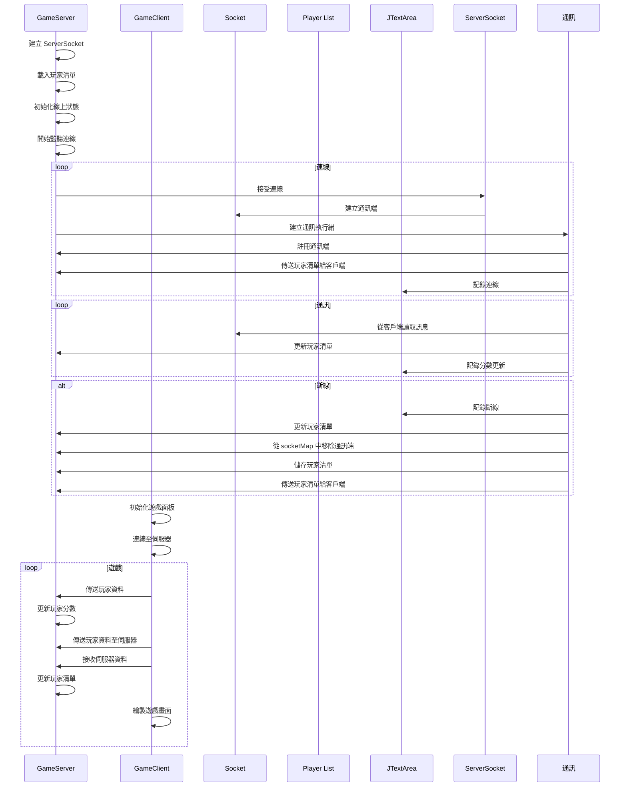

# 多媒體網路期末專題 - 貪食蛇遊戲
> B0943034 章沛倫

> git-repo: [https://github.com/mpeilun/Snake](https://github.com/mpeilun/Snake)
> demo影片: [https://youtu.be/fRPCKsP-cNE](https://youtu.be/fRPCKsP-cNE)

## 題目需求
1. 請將附件遊戲改成動態使用執行序的方式執行(newCachedThreadPool)含註解。(30%)
2. 請將本程式改為多人(3人以上)連線版本，含註解。(30%)
3. word報告，包含截圖以及製作之功能簡述。(30%)
> * 可以加入其他功能，例如: 即時訊息、分數同步...等等，每項5%(須有完整註解並詳細記載於word報告中)。
> * 滿分100%，其中註解、word報告是否良好會酌量扣分。

## 簡介
延續老師提供的單機貪吃蛇遊戲。改為多人連線，增加遊戲採排行榜機制作為勝利目標，可以透過不斷挑戰在排行榜上留下最高分的紀錄，實時與全部玩家同步分數。

## 如何使用

### Build版本(打包完成)
執行 Server端
`java -jar Snake.jar server`
執行 Client端
`java -jar Snake.jar client`
> 僅需執行請直接在終端機中，切換到當前目錄執行打包完成的`jar`檔案，執行Server，需要使用指令，附上參數才可以開啟(預設開啟Client)。

### 開發環境
1. IDE: IntelliJ IDEA
2. Java 版本: 17.0.4(Azul Zulu version)
3. 依賴項目管理: Maven
4. 第三方Package: gson-2.10.1
> 請從GitHub Clone此庫，並在'IntelliJ IDEA'中開啟，才可以確保依賴項目(Dependencies)可以正確import。

## 檔案結構
```
.
├── LICENSE - 軟體使用許可協議
├── playerList.json - 玩家列表資料檔案
├── pom.xml - Maven 專案配置檔案
├── readme.md - 專案說明文件
├── out - 構建輸出目錄
│   └── artifacts
│       └── Snake_jar
│           ├── readme.md - 構建輸出說明文件
│           └── Snake.jar - 構建輸出的執行檔案
└── src
    └── main
        └── java
            └── niu
                └── edu
                    └── b0943034
                        ├── GameFrame.java - 建立遊戲主視窗
                        ├── GamePanel.java - 遊戲主畫面邏輯
                        ├── GameServer.java - 遊戲伺服器
                        ├── Main.java - 主程式進入點
                        └── Player.java - 玩家類別
```
*

## Server-Client 溝通邏輯(Sequence Diagram)


## 題目基本需求實現方式
### 1. 將遊戲改成動態使用執行序的方式執行(newCachedThreadPool)含註解。

程式碼片段：
```java
exec = Executors.newCachedThreadPool();
exec.execute(new Communication(socket, playerList, txt, sdf, socketMap));
```

解釋：
- 使用`Executors.newCachedThreadPool()`方法建立一個可根據需要自動調整大小的執行緒池。
- 執行緒池會根據執行緒的需求來動態地增加或減少執行緒數量，適用於處理大量短期任務的場景。
- 使用`execute()`方法提交一個新的執行緒來處理客戶端的連接，以實現多人連線。

### 2. 將程式改為多人(3人以上)連線版本，含註解。

程式碼片段：
```java
while (true) {
    Socket socket = serverSocket.accept();
    exec.execute(new Communication(socket, playerList, txt, sdf, socketMap));
}
```

解釋：
- 使用`serverSocket.accept()`方法等待客戶端的連接，並返回一個新的Socket物件來處理該連接。
- 使用`exec.execute()`方法將客戶端連接交給執行緒池中的一個執行緒來處理，實現多人連線。

## 額外功能(加分項目)

1. 重新開始遊戲
    - 當遊戲結束後，玩家可以按下Enter鍵重新開始遊戲。
    - 程式會重置遊戲相關的變數，並重新開始遊戲的執行。

2. 歷史紀錄排行榜(存在Server中)
    - 程式會將玩家的最高分數保存在`playerList.json`檔案中。
    - 玩家的分數會在遊戲結束時更新，並且只有最高分數會被保存。
    - 玩家可以在遊戲中隨時查看最高分數排行榜。

> playerList.json 文件格式
``` json
[
  {
    "name": "B0943034",
    "port": 52158,
    "score": 6,
    "best": 6,
    "online": false
  },
  {
    "name": "P1",
    "port": 52166,
    "score": 3,
    "best": 3,
    "online": true
  },
  {
    "name": "P2",
    "port": 52171,
    "score": 8,
    "best": 8,
    "online": true
  },
  {
    "name": "P3",
    "port": 52178,
    "score": 4,
    "best": 4,
    "online": true
  }
]
```

3. 分數同步功能(在線玩家列表)
    - 客戶端會將自己的分數和在線狀態傳送給伺服器。
    - 伺服器會將所有玩家的分數和在線狀態傳送給所有連接的客戶端。
    - 客戶端根據接收到的玩家列表更新遊戲畫面中的在線玩家和分數資訊。

4. 例外處理斷開連線
    - 程式在通訊過程中會捕捉到可能發生的例外，例如斷開連線。
    - 當客戶端斷開連線時，伺服器會更新玩家的在線狀態並傳送新的玩家列表給其他客戶端。

5. 建立Player類，以Json格式，傳送玩家資訊
    - 程式中建立了一個Player類，用於保存玩家的資訊，包括名稱、連接埠、分數等。
    - 玩家的資訊會以Json格式進行序列化和反序列化，方便在伺服器和客戶端之間進行傳輸。

> Player.java 類別定義型態
```java
package niu.edu.b0943034;

public class Player {
    private String name;
    private int port;
    private int score;
    private int best;
    private boolean online;


    public Player(String name, int port, int score, int best, boolean online) {
        this.name = name;
        this.port = port;
        this.score = score;
        this.best = best;
        this.online = online;
    }

    //各屬性之get與set方法...
}
```

6. 防止撞自己身體(BUG修復)
    - 程式在移動蛇的過程中會檢查蛇頭的位置是否和蛇身體的位置重疊，以防止撞到自己的身體。
    - 檢查的方式是遍歷蛇身體的每一個部分，並比較其座標和蛇頭的座標是否相同。

7. 設計Server GUI
    - 程式中使用了Swing框架來設計伺服器的圖形用戶界面(GUI)。
    - 伺服器的運行狀態和客戶端的連接狀態會以文字的形式顯示在GUI中，方便管理和監控伺服器的運行情況。

## 詳細程式說明
### Server 端(GameServer.java)
#### 流程圖
[](https://mermaid.live/edit#pako:eNptk8tu2kAUhl_FcrfkAaBSpXC_hKRSuuo4C8vYDaqxEZgFiiI5EbRc0qSKWtPSNIQmAZIKaNMEEKTtyzAz9lt0GAcHVXjl-f9v_jlzRmeHFdSEyHrYVxk-vc288HPKKsCdKrw_sowqbFe3mJWVZ4wXwNJXsoIHhtky8HUNHh8g4y3s1uA7HTYaW5zipaAPmPdlWLzEh1ewN0CjIjR6xPRR0_-Ygso6OinbFK4X8LA-HVVwVUfFKsH9FA8AS7-ZZRWa-Lpn_r2FJyViBqgZBOjwEh7VYO8bKg3w976ln5MU4gepHwKwfAcnY0uvm50KbAzN5gEeHk9HLVg5I6GOgn6ekU0huik8C0UfBk4o3P9l6XukQJKB9voEDFMwAsz2OTp9b8t4f_xc5vNiBpevppMBoSKUigL05RYZPxabQRpnNfv4YgxLb9DHkQ046VG7jPkxMeBUgowheRDnkjHqrwE7a9F0stYoEgdmp4t_9x5avdBnUrXEy1mRoHGKrgP45zSrCq9FLc6np6Mubk-szxdOCZvUIvg6xTcALNzA7qfF283aa7fsrmU_sV0U6aATQwI25tfklKyWl0VmlZGSsux5Iklu8j2dy97lsm-57H-Q3e6Z4ciB5XJwuRxaLoedIwVhQY4sl6NOiCBIkiPH_pdZF5sSMyk-mSATuMMpDMOx2raYEjnWQ34TosTnZI1jOWWXoHxOUzfzisB6tExOdLG5dILXRH-SJ7ObYj30MV1smldequrjWkwkNTUTt6ecDvvuP0wz5hI)

#### 主要功能
1. 初始化伺服器視窗和文字區域，設置伺服器Socket和執行緒池。
2. 載入玩家清單，從檔案中讀取玩家清單的JSON格式並轉換為`List<Player>`物件。
3. 初始化所有玩家的線上狀態，將所有玩家的線上狀態設為false，並儲存玩家清單並傳送給所有連線的客戶端。
4. 進入無窮迴圈，接受客戶端的連線。
5. 當有客戶端連線時，創建通訊執行緒並加入執行緒池中。
6. 通訊執行緒的主要功能是接收客戶端傳送的訊息，解析為Player物件，並更新玩家清單和顯示分數更新訊息。
7. 若客戶端斷開連線，則在文字區域中顯示斷開連線的訊息，設置玩家的線上狀態為false，從`socketMap`中移除該客戶端Socket，並儲存玩家清單並傳送給所有連線的客戶端。

### Client 端(GamePanel.java)
#### 流程圖
[](https://mermaid.live/edit#pako:eNptkstKw0AUhl8ljFv7AM1CsPc2utGdMy5CMtFCOiltuigiWF1UrIqIlqpVoeIdtFioeH0aZ5K8hWOmU1GS1eT7_5lzzs9ZAYZjYqCCpYpeXlZm5hCZhkG7Ra9bQWOLbT4tKrHYlJKAwdqF93zsNwdf76-su0OPbhYRSYRiEgqruMZxMsQp6F2_0dahf9LkLBWyNGR3PXZ-yTqPdO-K7m3Qzb7fabGzLrekQ0tmZPF6fbZ_xnEmxFnovdz5Fx-ilHd4H5z2uJgNxRxku5fsYDjuzR80WfuI67lQz0O6PgjWGt7uLX0YCvHfKHnRs3yxANnxPW10RTm6v80aPfp5O8oEkYJoSto1GDR3WLv_JzlENBGenEGTM2oyD02GxQ-IVN26jZVpxSratjphWXH-SZqIpMlImhrRePyHS5qOpJlImo2kuXE1w_il-UhaGL9gGJYlqfaHgklQwpWSXjT5Aq4goigIuMu4hBFQ-dHEll6zXQQQWeVWveY683ViANWt1PAkqJVN3cWpos5XtwRUS7ernJZ1suA4v__YLLpOZVYsebjrq9-WdDoC)

#### 主要功能
1. 初始化遊戲：在遊戲開始時，使用者需要輸入伺服器的 IP 和 Port，以及自己的遊戲 ID。然後建立與伺服器的連線，並且建立玩家物件。接著開始遊戲。
2. 連線至伺服器：使用 Socket 建立與伺服器的連線，並且建立資料輸入和輸出串流，以便與伺服器進行資料的傳送和接收。同時使用 ExecutorService 建立執行緒池，用於執行資料接收任務。
3. 遊戲開始：遊戲開始時，初始化蛇的位置、蘋果的位置，並且設定遊戲狀態為運行中。然後啟動遊戲更新計時器，定時更新遊戲畫面。
4. 移動蛇：根據玩家的鍵盤輸入，改變蛇的移動方向。在每次遊戲更新時，根據蛇的移動方向，更新蛇的位置。
5. 檢查是否吃到蘋果：在每次遊戲更新時，檢查蛇的頭部是否與蘋果的位置重疊，如果是的話，則增加蛇的身體部分數量，並且更新分數。
6. 檢查碰撞：在每次遊戲更新時，檢查蛇的頭部是否與自己的身體或邊界重疊，如果是的話，遊戲結束。
7. 繪製遊戲畫面：根據遊戲的狀態，繪製遊戲畫面。如果遊戲尚未開始，則繪製開始畫面；如果遊戲正在運行中，則繪製蛇、蘋果、玩家列表和排行榜；如果遊戲結束，則繪製遊戲結束畫面。
8. 接收伺服器資料：在伺服器資料接收執行緒中，持續接收伺服器傳來的資料。接收到資料後，將其轉換為玩家列表，並且更新遊戲畫面。
9. 傳送玩家資料至伺服器：在更新玩家分數時，將玩家物件轉換為 JSON 字串，並且發送至伺服器。
10. 暫停遊戲和恢復遊戲：在玩家按下空白鍵時，切換遊戲的暫停狀態。
11. 重新開始遊戲：在遊戲結束後，玩家按下 Enter 鍵，重新初始化遊戲。

## 附錄(完整程式-含完整註解)
> GameServer.java
```java=
package niu.edu.b0943034;

import java.awt.*;
import java.io.*;
import java.net.*;
import java.text.SimpleDateFormat;
import java.util.*;
import java.util.List;
import java.util.concurrent.ExecutorService;
import java.util.concurrent.Executors;

import com.google.gson.Gson;
import com.google.gson.reflect.TypeToken;

import javax.swing.*;

public class GameServer extends JFrame {

    // 日期時間格式化物件
    private SimpleDateFormat sdf = new SimpleDateFormat("yyyy-MM-dd HH:mm:ss");

    // 顯示伺服器運行狀態的文字區域
    private JTextArea txt = new JTextArea("[" + sdf.format(new Date()) + "] " + "伺服器運行中...\n");

    // 伺服器Socket物件
    private ServerSocket serverSocket = null;

    // 存儲客戶端Socket的Map
    private static Map<Integer, Socket> socketMap = new HashMap<>();

    // 存儲玩家清單的List
    private static List<Player> playerList = new ArrayList<>();

    // 執行緒池
    private ExecutorService exec = null;

    public GameServer(int port) throws IOException, SocketException {
        setTitle("Snake Server");

        // 設置文字區域為不可編輯並添加到視窗中
        txt.setEditable(false);
        txt.append("[" + sdf.format(new Date()) + "] " + "執行於 port:" + port + "...\n");
        setLayout(new BorderLayout());
        this.add(new JScrollPane(txt), BorderLayout.CENTER);
        setSize(500, 300);
        setDefaultCloseOperation(JFrame.EXIT_ON_CLOSE);
        setVisible(true);

        // 創建ServerSocket並監聽指定的port
        serverSocket = new ServerSocket(port);

        // 創建執行緒池
        exec = Executors.newCachedThreadPool();

        // 載入玩家清單
        loadPlayerList();

        // 初始化所有玩家的線上狀態
        initOnlineStatus();

        while (true) {
            // 接受客戶端的連線
            Socket socket = serverSocket.accept();

            // 創建通訊執行緒並加入執行緒池中
            exec.execute(new Communication(socket, playerList, txt, sdf, socketMap));
        }
    }

    // 載入玩家清單
    public void loadPlayerList() {
        try {
            // 檢查玩家清單檔案是否存在，若不存在則創建新的檔案
            File file = new File("playerList.json");
            if (!file.exists()) {
                file.createNewFile();
            } else {
                // 讀取玩家清單檔案中的內容並轉換為List<Player>物件
                BufferedReader br = new BufferedReader(new FileReader(file));
                StringBuilder sb = new StringBuilder();
                String line;
                while ((line = br.readLine()) != null) {
                    sb.append(line);
                }
                br.close();
                String json = sb.toString();
                Gson gson = new Gson();
                playerList = gson.fromJson(json, new TypeToken<List<Player>>() {
                }.getType());
            }
        } catch (Exception e) {
            e.printStackTrace();
        }
    }

    // 儲存玩家清單
    public static void savePlayerList() {
        try {
            // 將玩家清單轉換為JSON格式並寫入檔案中
            Gson gson = new Gson();
            String json = gson.toJson(playerList);
            FileWriter writer = new FileWriter("playerList.json");
            writer.write(json);
            writer.close();
        } catch (IOException e) {
            e.printStackTrace();
        }
    }

    // 傳送玩家清單給所有連線的客戶端
    public static void sendPlayerList(Map<Integer, Socket> socketMap) {
        try {
            // 將玩家清單轉換為JSON格式並傳送給每個客戶端
            Gson gson = new Gson();
            String json = gson.toJson(playerList);
            System.out.println("Send: " + json);
            for (Socket socket : socketMap.values()) {
                DataOutputStream toClient = new DataOutputStream(socket.getOutputStream());
                toClient.writeUTF(json);
                toClient.flush();
            }
        } catch (Exception e) {
            e.printStackTrace();
        }
    }

    // 更新玩家清單
    public static void updatePlayerList(Player player) {
        // 檢查玩家是否已存在於清單中
        Player existingPlayer = playerList.stream()
                .filter(p -> p.getName().equals(player.getName()) && p.getPort() == player.getPort())
                .findFirst()
                .orElse(null);
        if (existingPlayer != null) {
            // 若玩家已存在，則更新分數和最佳分數，並將線上狀態設為true
            existingPlayer.setScore(player.getScore());
            if (existingPlayer.getBest() < player.getBest()) {
                existingPlayer.setBest(player.getBest());
            }
            existingPlayer.setOnline(true);
        } else {
            // 若玩家不存在，則將玩家添加到清單中
            playerList.add(player);
        }
        // 儲存玩家清單並傳送給所有連線的客戶端
        savePlayerList();
        sendPlayerList(socketMap);
    }

    // 初始化所有玩家的線上狀態
    public void initOnlineStatus() {
        // 將所有玩家的線上狀態設為false
        for (Player player : playerList) {
            player.setOnline(false);
        }
        // 儲存玩家清單並傳送給所有連線的客戶端
        savePlayerList();
        sendPlayerList(socketMap);
    }

    // 通訊執行緒
    public static class Communication implements Runnable {
        private Socket socket;
        private DataInputStream fromClient;
        private String msg;
        private final List<Player> playerList;
        private final JTextArea txt;
        private final SimpleDateFormat sdf;
        private final Map<Integer, Socket> socketMap;

        public Communication(Socket socket, List<Player> playerList, JTextArea txt, SimpleDateFormat sdf, Map<Integer, Socket> socketMap)
                throws IOException, SocketException {
            this.socket = socket;
            this.playerList = playerList;
            this.txt = txt;
            this.sdf = sdf;
            this.socketMap = socketMap;

            // 創建從客戶端讀取訊息的DataInputStream物件
            fromClient = new DataInputStream(socket.getInputStream());

            // 將客戶端Socket加入socketMap中並傳送玩家清單給該客戶端
            socketMap.put(socket.getPort(), socket);
            sendPlayerList(socketMap);

            // 在文字區域中顯示連線成功的訊息
            txt.append("[" + sdf.format(new Date()) + "]" + "[ :" + socket.getPort() + "] 連接成功\n");
        }

        @Override
        public void run() {
            try {
                while ((msg = fromClient.readUTF()) != null) {
                    // 接收客戶端傳送的訊息並解析為Player物件
                    System.out.println("Received: " + msg);
                    Gson gson = new Gson();
                    Player player = gson.fromJson(msg, Player.class);
                    player.setOnline(false);

                    // 更新玩家清單並在文字區域中顯示分數更新訊息
                    updatePlayerList(player);
                    txt.append("[" + sdf.format(new Date()) + "]" + "[" + player.getName() + ":" + socket.getPort() + "] 更新分數為 "
                            + player.getScore() + "\n");
                }
            } catch (Exception e) {
                // 在文字區域中顯示斷開連線的訊息
                txt.append("[" + sdf.format(new Date()) + "]" + "[ :" + socket.getPort() + "] 斷開連線\n");

                // 獲取斷開連線的玩家並設置線上狀態為false，從socketMap中移除該客戶端Socket
                Player disconnectedPlayer = playerList.stream().filter(p -> p.getPort() == socket.getPort()).findFirst().orElse(null);
                if (disconnectedPlayer != null) {
                    disconnectedPlayer.setOnline(false);
                    socketMap.remove(socket.getPort());

                    // 儲存玩家清單並傳送給所有連線的客戶端
                    savePlayerList();
                    sendPlayerList(socketMap);
                }
            }
        }
    }
}
```

> GameFrame.java
```java=
package niu.edu.b0943034;

import javax.swing.JFrame;

@SuppressWarnings("serial")
public class GameFrame extends JFrame {

    public GameFrame() {
        this.add(new GamePanel());
        this.setTitle("Snake");
        this.setDefaultCloseOperation(JFrame.EXIT_ON_CLOSE);
        this.pack();
        this.setVisible(true);
        this.setLocationRelativeTo(null);
        this.setResizable(false);
    }
}
```

> GamePanel.java
```java=
package niu.edu.b0943034;

import com.google.gson.Gson;
import com.google.gson.reflect.TypeToken;

import java.awt.*;
import java.awt.event.*;
import java.io.*;
import java.lang.reflect.Type;
import java.net.*;
import java.util.*;
import java.util.List;
import java.util.concurrent.ExecutorService;
import java.util.concurrent.Executors;
import java.util.stream.Collectors;
import javax.swing.*;
import javax.swing.Timer;

public class GamePanel extends JPanel implements ActionListener {

    private ExecutorService exec; // 執行緒池，用於執行資料接收任務
    private Socket clientSocket; // 客戶端 Socket
    private DataInputStream fromServer; // 從伺服器接收資料的輸入串流
    private DataOutputStream toServer; // 向伺服器發送資料的輸出串流

    private static final int SCREEN_WIDTH = 500; // 螢幕寬度
    private static final int SCREEN_HEIGHT = 500; // 螢幕高度
    private static final int UNIT_SIZE = 10; // 單位大小
    private static final int GAME_UNITS = (SCREEN_WIDTH * SCREEN_HEIGHT) / UNIT_SIZE; // 遊戲單位數量
    private static final int DELAY = 55; // 遊戲更新間隔時間

    private final int[] x = new int[GAME_UNITS]; // 蛇身體的 x 坐標
    private final int[] y = new int[GAME_UNITS]; // 蛇身體的 y 坐標
    private int bodyParts = 3; // 蛇身體的部分數量
    private int applesEaten = 0; // 吃到的蘋果數量
    private String receivedMessage; // 從伺服器接收的訊息
    private List<Player> playerList = new ArrayList<>(); // 玩家列表
    private int appleX; // 蘋果的 x 坐標
    private int appleY; // 蘋果的 y 坐標
    private char direction = 'R'; // 蛇的移動方向，初始為右方
    private boolean running = false; // 遊戲是否運行中
    private boolean started = false; // 遊戲是否已開始
    private boolean paused = false; // 遊戲是否暫停中
    private boolean gameOver = false; // 遊戲是否結束
    private Timer timer = new Timer(DELAY, this); // 遊戲更新計時器
    private Random random; // 隨機數生成器
    private Player player; // 玩家資訊

    public GamePanel() {
        random = new Random();
        this.setPreferredSize(new Dimension(SCREEN_WIDTH, SCREEN_HEIGHT));
        this.setBackground(Color.BLACK);
        this.setFocusable(true);
        this.addKeyListener(new MyKeyAdapter());

        // 詢問伺服器的 IP 和 Port
        String inputIpPort = JOptionPane.showInputDialog(null, "請輸入 IP:Port", "localhost:8888");
        String[] ipPortArr = inputIpPort.split(":");
        String host = ipPortArr[0];
        int port = Integer.parseInt(ipPortArr[1]);

        // 連線至伺服器
        client(host, port);

        // 詢問玩家的遊戲 ID
        String inputName = "";
        while (inputName.isEmpty()) {
            inputName = JOptionPane.showInputDialog(null, "請輸入遊戲 ID：");
        }

        // 建立玩家物件
        player = new Player(inputName, clientSocket.getLocalPort(), 0, 0, true);

        startGame();
    }

    // 連線至伺服器
    private void client(String host, int port) {
        try {
            clientSocket = new Socket(host, port);
            fromServer = new DataInputStream(clientSocket.getInputStream());
            toServer = new DataOutputStream(clientSocket.getOutputStream());

            exec = Executors.newCachedThreadPool();
            exec.execute(new ClientSocket());

        } catch (IOException e) {
            e.printStackTrace();
        }
    }

    // 伺服器資料接收執行緒
    class ClientSocket implements Runnable {
        @Override
        public void run() {
            try {
                while (true) {
                    receivedMessage = fromServer.readUTF();
                    System.out.println("Received: " + receivedMessage);
                    topdata(receivedMessage);
                }
            } catch (IOException e) {
                e.printStackTrace();
            } finally {
                try {
                    if (clientSocket != null || started == false) {
                        clientSocket.close();
                    }
                } catch (IOException e) {
                    e.printStackTrace();
                }
            }
        }
    }

    // 遊戲開始
    public void startGame() {
        if (started && paused) {
            return;
        }
        updateScore(player, 0); // 更新玩家分數為 0
        newApple(); // 產生新的蘋果
        running = true; // 開始遊戲

        // 計算螢幕中心點的坐標
        int centerX = SCREEN_WIDTH / 2;
        int centerY = SCREEN_HEIGHT / 2;

        // 設置蛇頭的起始位置為螢幕中心
        x[0] = centerX;
        y[0] = centerY;

        // 計算蛇身體初始位置
        for (int i = 1; i < bodyParts; i++) {
            x[i] = centerX - i * UNIT_SIZE;
            y[i] = centerY;
        }

        timer.start(); // 啟動遊戲更新計時器
    }

    // 產生新的蘋果
    public void newApple() {
        appleX = random.nextInt((int) (SCREEN_WIDTH / UNIT_SIZE)) * UNIT_SIZE;
        appleY = random.nextInt((int) (SCREEN_HEIGHT / UNIT_SIZE)) * UNIT_SIZE;
    }

    @Override
    public void actionPerformed(ActionEvent arg0) {
        if (running && !paused) {
            move(); // 移動蛇
            checkApple(); // 檢查是否吃到蘋果
            checkCollisions(); // 檢查碰撞
        }
        repaint(); // 重新繪製遊戲畫面
    }

    // 鍵盤事件監聽器
    public class MyKeyAdapter extends KeyAdapter {
        @Override
        public void keyPressed(KeyEvent e) {
            switch (e.getKeyCode()) {
                case KeyEvent.VK_LEFT:
                    if (direction != 'R') {
                        direction = 'L'; // 左
                    }
                    break;

                case KeyEvent.VK_RIGHT:
                    if (direction != 'L') {
                        direction = 'R'; // 右
                    }
                    break;

                case KeyEvent.VK_UP:
                    if (direction != 'D') {
                        direction = 'U'; // 上
                    }
                    break;

                case KeyEvent.VK_DOWN:
                    if (direction != 'U') {
                        direction = 'D'; // 下
                    }
                    break;

                case KeyEvent.VK_SPACE:
                    if (paused) {
                        resume(); // 恢復遊戲
                    } else if (running) {
                        pause(); // 暫停遊戲
                    }
                    break;
                case KeyEvent.VK_ENTER:
                    if (!started) {
                        started = true;
                        startGame(); // 開始遊戲
                    } else if (gameOver) {
                        started = false;
                        restartGame(); // 重新開始遊戲
                    }
                    break;
            }
        }
    }

    // 移動蛇
    public void move() {
        for (int i = bodyParts; i > 0; i--) {
            x[i] = x[i - 1];
            y[i] = y[i - 1];
        }
        switch (direction) {
            case 'U':
                y[0] -= UNIT_SIZE; // 向上移動
                break;
            case 'D':
                y[0] += UNIT_SIZE; // 向下移動
                break;
            case 'L':
                x[0] -= UNIT_SIZE; // 向左移動
                break;
            case 'R':
                x[0] += UNIT_SIZE; // 向右移動
                break;
        }
    }

    // 檢查是否吃到蘋果
    public void checkApple() {
        if ((x[0] == appleX) && (y[0] == appleY)) {
            bodyParts++; // 蛇身體增加一部分
            applesEaten++; // 吃到的蘋果數量增加
            updateScore(player, applesEaten); // 更新玩家分數
            newApple(); // 產生新的蘋果
        }
    }

    // 檢查碰撞
    public void checkCollisions() {
        for (int i = bodyParts; i > 0; i--) {
            if ((x[0] == x[i]) && (y[0] == y[i])) {
                running = false; // 蛇頭碰到自己的身體，遊戲結束
            }
        }
        if (x[0] < 0 || x[0] > SCREEN_WIDTH || y[0] < 0 || y[0] > SCREEN_HEIGHT) {
            running = false; // 蛇頭碰到邊界，遊戲結束
        }
        if (!running) {
            timer.stop(); // 停止遊戲更新計時器
            paused = false; // 取消暫停狀態
        }
    }

    @Override
    public void paintComponent(Graphics g) {
        super.paintComponent(g);
        draw(g); // 繪製遊戲畫面
    }

    // 更新伺服器資料
    public void topdata(String receivedMessage) {
        Gson gson = new Gson();
        Type type = new TypeToken<List<Player>>() {
        }.getType();
        playerList = gson.fromJson(receivedMessage, type); // 將接收到的 JSON 資料轉換為玩家列表
    }

    // 傳送玩家資料至伺服器
    public void sendMessage(Player player) {
        try {
            Gson gson = new Gson();
            String json = gson.toJson(player); // 將玩家物件轉換為 JSON 字串
            System.out.println("Send: " + json);
            toServer.writeUTF(json); // 發送 JSON 字串至伺服器
        } catch (IOException e) {
            e.printStackTrace();
        }
    }

    // 更新玩家分數
    public void updateScore(Player player, int score) {
        player.setScore(score); // 更新玩家分數
        player.setBest(score); // 更新玩家最高分數
        sendMessage(player); // 傳送玩家資料至伺服器
    }

    // 繪製遊戲畫面
    public void draw(Graphics g) {
        if (!started) {
            drawStartScreen(g); // 繪製開始畫面
        } else if (running) {
            drawSnake(g); // 繪製蛇
            drawPlayerList(g); // 繪製玩家列表
            drawTopRank(g); // 繪製排行榜
            if (paused) {
                drawPauseScreen(g); // 繪製暫停畫面
            }
        } else {
            gameOver(g); // 繪製遊戲結束畫面
        }
    }

    // 繪製開始畫面
    private void drawStartScreen(Graphics g) {
        g.setColor(Color.WHITE);
        g.setFont(new Font("Monospaced", Font.BOLD, 24));
        FontMetrics metrics = getFontMetrics(g.getFont());
        String nameAndPort = "[ID] " + player.getName() + ":" + player.getPort();
        g.drawString(nameAndPort, (SCREEN_WIDTH - metrics.stringWidth("[Enter] => 開始遊戲")) / 2, SCREEN_HEIGHT / 2 - 16);
        g.setColor(Color.RED);
        g.drawString("[Enter] => 開始遊戲", (SCREEN_WIDTH - metrics.stringWidth("[Enter] => 開始遊戲")) / 2, SCREEN_HEIGHT / 2 + 32);
        g.drawString("[Space] => 暫停遊戲", (SCREEN_WIDTH - metrics.stringWidth("[Space] => 暫停遊戲")) / 2, (SCREEN_HEIGHT / 2) + 64);
    }

    // 繪製蛇
    private void drawSnake(Graphics g) {
        g.setColor(Color.RED);
        g.fillOval(appleX, appleY, UNIT_SIZE, UNIT_SIZE); // 繪製蘋果

        for (int i = 0; i < bodyParts; i++) {
            g.setColor(i == 0 ? Color.BLUE : Color.GREEN);
            g.fillRect(x[i], y[i], UNIT_SIZE, UNIT_SIZE); // 繪製蛇的身體部分，蛇頭為藍色，其餘部分為綠色
        }
    }

    // 繪製玩家列表
    private void drawPlayerList(Graphics g) {
        int text_y = 0;
        int x_pos = 10;

        g.setColor(Color.WHITE);
        g.setFont(new Font("Monospaced", Font.BOLD, 16));
        g.drawString("↳在線玩家", x_pos, g.getFont().getSize());
        text_y++;

        Comparator<Player> scoreComparator = (p1, p2) -> p2.getScore() - p1.getScore();
        Collections.sort(playerList, scoreComparator); // 根據分數排序玩家列表

        for (Player p : playerList) {
            if (p.getOnline()) {
                g.setFont(new Font("Monospaced", Font.BOLD, 14));
                String playerString = p.getName() + ":" + p.getPort() + " " + p.getScore();
                g.setColor(p.getPort() == player.getPort() ? Color.YELLOW : Color.CYAN);
                g.drawString(p.getPort() == player.getPort() ? "•" : "", x_pos + 8, g.getFont().getSize() + text_y * 20);
                g.drawString(playerString, x_pos + 20, g.getFont().getSize() + text_y * 20);
                text_y++;
            }
        }
    }

    // 繪製排行榜
    private void drawTopRank(Graphics g) {
        int text_y = 0;
        int x_pos = 340;

        g.setColor(Color.WHITE);
        g.setFont(new Font("Monospaced", Font.BOLD, 16));
        g.drawString("↳歷史排行榜(TOP3)", x_pos, g.getFont().getSize());
        text_y++;

        Comparator<Player> scoreComparator = (p1, p2) -> p2.getBest() - p1.getBest();
        List<Player> topPlayers = playerList.stream().sorted(scoreComparator).limit(3).collect(Collectors.toList()); // 根據最高分數排序取前三名

        for (Player p : topPlayers) {
            g.setFont(new Font("Monospaced", Font.BOLD, 14));
            String playerString = p.getName() + ":" + p.getPort() + " " + p.getBest();
            g.setColor(p.getPort() == player.getPort() ? Color.RED : Color.CYAN);
            g.drawString(p.getPort() == player.getPort() ? "•" : "", x_pos + 8, g.getFont().getSize() + text_y * 20);
            g.drawString(playerString, x_pos + 20, g.getFont().getSize() + text_y * 20);
            text_y++;
        }
    }

    // 繪製暫停畫面
    private void drawPauseScreen(Graphics g) {
        drawCenteredString(g, new Font("Monospaced", Font.BOLD, 24), Color.YELLOW, "遊戲暫停中...", SCREEN_HEIGHT / 2);
    }

    // 繪製遊戲結束畫面
    public void gameOver(Graphics g) {

        Font font = new Font("Monospaced", Font.BOLD, 36);
        drawCenteredString(g, font, Color.RED, "遊戲結束", SCREEN_HEIGHT / 2);

        font = new Font("Monospaced", Font.BOLD, 30);
        int y = (SCREEN_HEIGHT / 2) + 50;
        drawCenteredString(g, font, Color.RED, "Score: " + applesEaten, y);

        y += 75;
        drawCenteredString(g, font, Color.BLUE, "按下 Enter 重新開始遊戲...", y);

        gameOver = true;
    }

    // 重新開始遊戲
    public void restartGame() {
        updateScore(player, 0);

        running = false;
        started = false;
        paused = false;
        gameOver = false;
        bodyParts = 3;
        applesEaten = 0;
        receivedMessage = "";
        playerList.clear();
        direction = 'R';
        timer.stop();
        random = new Random();

        Arrays.fill(x, 0);
        Arrays.fill(y, 0);

        repaint();
        startGame();
    }

    // 暫停遊戲
    public void pause() {
        paused = true;
        repaint();
    }

    // 恢復遊戲
    public void resume() {
        paused = false;
    }

    // 繪製文字置中
    public void drawCenteredString(Graphics g, Font font, Color color, String text, int y) {
        g.setColor(color);
        g.setFont(font);
        FontMetrics metrics = g.getFontMetrics(font);
        int x = (SCREEN_WIDTH - metrics.stringWidth(text)) / 2;
        g.drawString(text, x, y);
    }
}
```

> Player.java
```java=
package niu.edu.b0943034;

public class Player {
    private String name;
    private int port;
    private int score;
    private int best;
    private boolean online;


    public Player(String name, int port, int score, int best, boolean online) {
        this.name = name;
        this.port = port;
        this.score = score;
        this.best = best;
        this.online = online;
    }

    public String getName() {
        return name;
    }

    public int getPort() {
        return port;
    }

    public int getScore() {
        return score;
    }

    public void setScore(int score) {
        this.score = score;
    }

    public int getBest() {
        return best;
    }

    public void setBest(int best) {
        this.best = best;
    }

    public boolean getOnline() {
        return online;
    }

    public void setOnline(boolean online) {
        this.online = online;
    }
}
```

> Main.java
```java=
package niu.edu.b0943034;

import java.io.IOException;
import java.net.InetSocketAddress;
import java.net.URISyntaxException;

public class Main {
    public static void main(String[] args) throws IOException, URISyntaxException {
        int port = 8888;

        if (args.length > 0 && args[0].equals("server")) {
            GameServer server = new GameServer(port);  // 啟動伺服器
        } else {
            GameFrame client = new GameFrame(); // 啟動客戶端
        }
    }
}

```